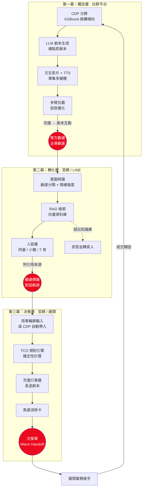
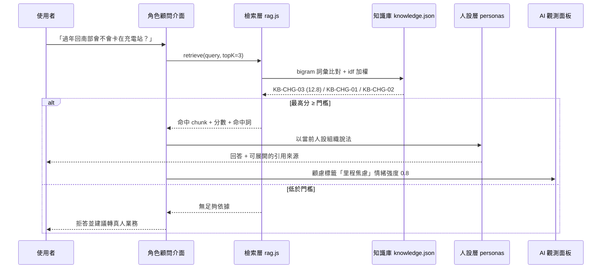

# AI 劇場 EV Drama Studio

**2026 和泰 AI 黑客松｜智能轉型：AI 助攻油轉電 TOYOTA EV 新生活**
隊伍：請下一隊上場

> 用 AI 短劇把陌生人變觀眾，用劇中角色把觀眾變準客戶

---

## 🎬 概念原型

**線上互動版：** https://weicheng28.github.io/TOYOTA-EV/

四個畫面對應簡報的三幕架構，可依序點擊走完一次完整的顧客旅程：

| 畫面 | 對應簡報 | 這一頁證明了什麼 |
| --- | --- | --- |
| ① AI 短劇（IG Reels 介面） | P8 第一幕 | 痛點如何被寫成戲劇衝突，以及劇末鉤子如何取得零方數據 |
| ② 角色顧問（對話介面） | P9 第二幕 | 同一組知識庫、三種人設口吻；每句回答可展開引用來源；超出範圍即拒答 |
| ③ 數位分身試駕（試算報告） | P10 第三幕 | 成本數字由確定性規則引擎算出，非 LLM 生成，常數逐項可稽核 |
| ④ 業務交接單 | P10 交接單 | 前三幕累積的互動軌跡自動生成，使用者不需填任何表單 |

原型全程共用同一份 `state`：第一幕的選擇會決定第二幕的開場白、第三幕的焦慮消除卡與第四幕的建議話術。
**這就是本方案最關鍵的體驗設計 — 敘事連續性 — 的可執行證明。**

---

## 系統架構



### 一句話說明架構原則

> **算數字的用確定性演算法，說人話的用生成式 AI。**
> 兩者透過 Function Calling 分工，確保「可信」與「好懂」同時成立。

`docs/js/tco.js` 完全不含 LLM 呼叫，同樣輸入必得同樣結果；
`docs/js/rag.js` 只負責「該引用哪幾則」，不負責生成內容。
生成式模型的職責被嚴格限縮在「表達」，而非「計算」。

---

## 一次對話的資料流



---

## 目錄結構

```
.
├── docs/                       ← GitHub Pages 網站根目錄（概念原型）
│   ├── index.html              四幕版面
│   ├── css/style.css
│   ├── js/
│   │   ├── app.js              狀態機・三幕共用 state・觀測面板
│   │   ├── tco.js              TCO 規則引擎（純函式，可稽核）
│   │   └── rag.js              檢索層（中文 bigram 詞彙檢索）
│   └── data/
│       ├── knowledge.json      RAG 知識庫（14 則，含來源與核實狀態）
│       └── drama.json          EP1 分鏡 + 三人設對話腳本
├── tools/
│   └── rag_eval.js             檢索邊界校準（24 題標註集）
├── analysis/
│   ├── cdp_profile.py          重現簡報所有 CDP 數字的分析腳本
│   └── output/                 統計 JSON 與圖表（可直接放進簡報）
├── 初賽內容稿.md               簡報逐頁內容稿
└── 初賽內容稿.pdf
```

---

## 本機執行

原型為純靜態網頁，無建置流程、無 node_modules、無外部 API 金鑰。

```bash
cd docs
python -m http.server 8000
# 瀏覽 http://localhost:8000
```

> 需透過 HTTP 開啟（直接雙擊 `index.html` 會因同源政策無法讀取 JSON，頁面會顯示對應說明）。

重跑 CDP 分析（需主辦方原始 CSV，**不隨本 repo 發布**）：

```bash
python analysis/cdp_profile.py --data-dir "D:/黑客松競賽"
```

---

## 資料分析與可重現性

簡報中所有標註 `[資料]` 的 CDP 數字，皆可由 `analysis/cdp_profile.py` 完整重現。

**資料基準日 2026-06-01** — 以「現保有車交車日期」最大值 2026-05-09 為起點逐日試算，
於此日車齡分組人數與主辦方口徑完全一致（四組誤差為 0），故採為基準日。

| 簡報引用 | 重現結果 |
| --- | --- |
| 零回廠比例 vs 車齡（7.1% → 27.5% → 58.8% → 76.1%） | ✅ 完全一致 |
| 車齡分組樣本數（189,042 / 274,825 / 284,956 / 299,752） | ✅ 完全一致 |
| 全體零回廠 46.2%、持有 7 年以上 55.8% | ✅ 完全一致 |
| 換購黃金池 318,102 人 / 30.3% / 男 61.5% / 中位 52.9 歲 / 六都 66.8% | ✅ 完全一致 |
| bZ4X 3,037 人 / 男 74.0% / 中位 50.1 歲 / 76.5% vs 72.1% | ✅ 完全一致 |
| 定保金額對照樣本數（n=219,569 / n=1,222） | ✅ 完全一致 |

### ⚠ 一項口徑修正

原稿 P10 的平均數與中位數取自不同母體（平均含未定保者、中位數排除未定保者），
兩者無法互相解釋。**本 repo 統一為「該車齡區間全體車主」口徑：**

| | 燃油車 | bZ4X | 差異 |
| --- | ---: | ---: | ---: |
| 近一年定保金額（平均） | 1,332 | 682 | **−49%** |
| 近一年定保金額（中位數） | 1,280 | 433 | **−66%** |

幣別為 A 國幣值，非台幣；簡報一律以相對比例呈現。

---

## 個資與資料邊界

- 主辦方提供之 CDP 原始 CSV **不上傳**，已於 `.gitignore` 阻擋（`*.csv`、`CDP*`、`*品牌調查*`）
- `analysis/output/` 僅輸出**聚合統計**與圖表，不含任何個別記錄
- 原型的交接單僅呈現使用者主動提供之零方數據與站上行為軌跡，未串接任何個資欄位

---

## 初賽版實作範圍

誠實說明「哪些是真的在跑」與「哪些是決賽才會做」，供評審判斷可行性：

| 模組 | 初賽原型（本 repo） | 決賽完整版 |
| --- | --- | --- |
| 短劇產製 | 文字分鏡呈現劇本結構與鉤子設計 | 文生影片模型 + TTS，單集 5–8 變體 |
| 檢索層 | 中文 bigram + idf 詞彙檢索，離線可跑，24 題標註集校準拒答邊界 | 向量資料庫（pgvector / Pinecone），`retrieve()` 介面不變 |
| 顧問對話 | 三人設腳本 + 真實檢索綁定引用來源 + 拒答邊界 | LLM 即時生成，人設 Prompt + Function Calling |
| TCO 試算 | **完整實作**，純函式、常數逐項標註來源 | 串接 CDP 以車主真實回廠紀錄為對照基準 |
| 顧慮 / 情緒辨識 | 依互動選擇與問題標籤累積 | LLM 意圖分類 + 情緒強度偵測 |
| 車主分群 | `analysis/cdp_profile.py` 完成輪廓分析 | XGBoost / LightGBM 換購傾向預測 |
| 投放優化 | 未實作（簡報方法論） | 多臂拉霸 |

---
## 規格來源與待確認事項

車輛規格已全數改採 **TOYOTA bZ4X 2026 年式官方型錄**，主要數值：

| 項目 | 數值 | 型錄出處 |
| --- | --- | --- |
| 電池容量 | 74.7 kWh 鋰離子 | p.04、p.25 |
| 用電效率 | 6.7 km/kWh（NEDC 實驗室值） | p.25 |
| 純電里程 | 743 km（NEDC 實驗室值） | p.04、p.25 |
| DC 快充 | 最大 160 kW，CCS1，充至 80% 約 28 分鐘 | p.21 |
| AC 慢充 | 11 kW，SAE J1772，0→100% 約 7 小時 | p.21 |
| 整車保固 | 4 年或 12 萬公里（先到者為準） | p.25 |
| 充電網絡 | 公共站點 >1,000、含合作夥伴 >1,300、TOYOTA 據點 >80 | p.22 |
| 馬達 | 永磁同步 227 ps / 27.4 kg-m | p.25 |

### 里程計算不直接使用型錄公告值

型錄自身註記續航測試值「因受天候、路況、載重、使用空調系統、駕駛習慣及車輛維護保養等
因素影響，實際值可能與測試值有所差異」。若直接以 6.7 km/kWh 推算，滿電可用里程會達
450 公里，全台任何長途都不需中途充電 — 這種結論不會有人相信。

因此 `tco.js` 設有 `realWorldFactor = 0.8`「假設」，折算後道路實用能耗為
**5.36 km/kWh**、滿電可用里程約 **360 公里**。此係數在原型的「計算假設」抽屜中公開顯示。

### 電池保固條款：型錄未載明，一律不推測

型錄僅標示整車保固 4 年或 12 萬公里，**未載明動力電池的容量保固年限、衰退門檻或保固期外
更換費用**。`KB-BAT-02` 因此標記為 `verified: false`，知識庫內容明確寫出「這一項沒有資料」。

角色顧問被問到換電池費用時，會直接說明查不到並提供轉接業務的選項，而不是給一個推測值。
市調中 58% 的人以「更換電池費用昂貴」為不考慮 BEV 的主因，正是因為這項資訊長期不透明 —
**用猜的數字回答只會讓不信任更嚴重**。這也是本方案「每句話都可查證」原則的實際體現。

- [ ] **向和泰汽車調閱動力電池保固條款正本**（唯一仍會影響提案說服力的缺口）
- [ ] `tco.js` `fuelPricePerL` / `elecHomePerKwh` / `elecPublicPerKwh` 油電價假設值
- [ ] `tco.js` `gasMaintAnnual` 燃油車年均定保支出台幣假設值
- [ ] `tco.js` `VEHICLES` 各燃油車款公告油耗值
- [x] 電動車免徵牌照稅與燃料費適用年度 → 現行優惠適用至 **2030 年**

---

## 檢索邊界的校準

顧問只回答知識庫涵蓋的問題，超出範圍必須拒答。門檻不是憑感覺設的：

```bash
node tools/rag_eval.js
```

以 24 題標註集（16 題職域內、8 題離題）校準。實測發現**單看檢索分數無法分離兩者** —
離題的「你們有賣機車嗎」拿到 6.46 分，比職域內最低的「充電要充多久」6.43 分還高，
因為「有賣」確實命中語料。故另引入**詞彙覆蓋率**（查詢詞被語料命中的比例）：
職域內最低 0.59、離題最高 0.50，門檻取 0.55。目前 24 題全數通過。

修改知識庫後務必重跑此腳本，確認門檻仍成立。
---

## 文件

| 檔案 | 說明 |
| --- | --- |
| [初賽內容稿.md](初賽內容稿.md) | 初賽簡報逐頁內容稿（可線上閱讀、可搜尋） |
| [初賽內容稿.pdf](初賽內容稿.pdf) | 同一份稿子的 PDF 原檔，排版為準 |

## 資料來源

1. 主辦方提供：2026 AI 黑客松 CDP 資料（T 車輛），n = 1,048,575
2. 主辦方提供：2026 AI 黑客松 CDP 電動車主補充資料（T 車輛），n = 3,037（全為 bZ4X）
3. 主辦方提供：2025 W3 TOYOTA 品牌調查報告（Kantar, 2025）
4. TOYOTA bZ4X 2026 年式官方型錄（`CAR_2026061516341694702228.pdf`）— 車輛規格、充電規格與充電網絡
